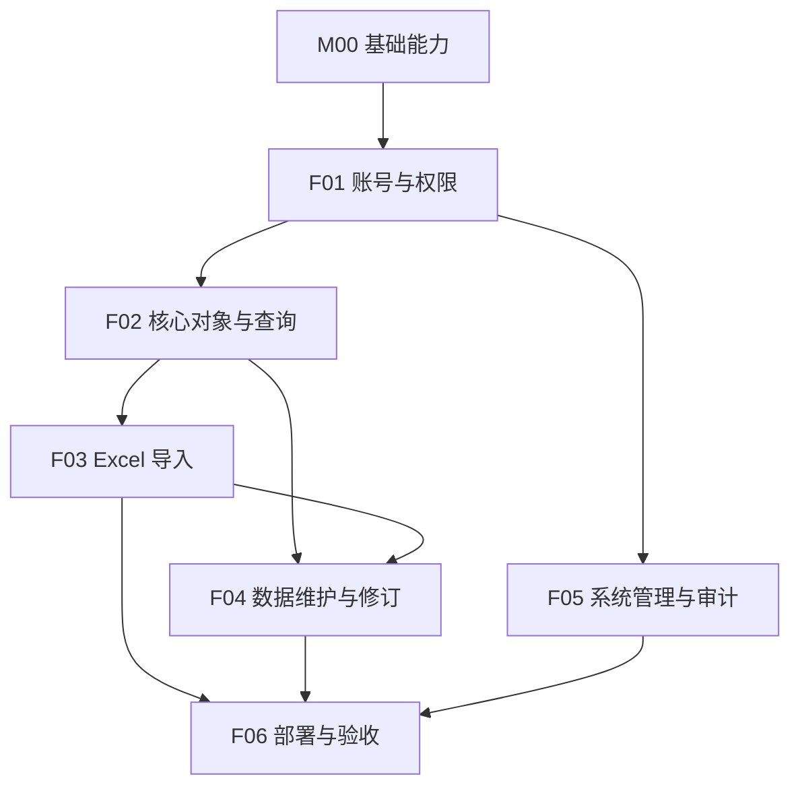

# POM 历史采购报价查询系统 V1.0 研发任务清单

## 文档信息

| 项目 | 内容 |
| --- | --- |
| 项目名称 | POM 历史采购报价查询系统 |
| 专项名称 | V1.0 MVP 全量实现（Monorepo：backend + frontend + deploy） |
| 目标版本 | V1.0 |
| 文档版本 | V1.0 |
| 创建日期 | 2026-09-09 |
| 最后更新 | 2026-09-09 |
| 文档状态 | 执行中 |
| 适用仓库 | `backend/`、`frontend/`、`deploy/`、`fixtures/`、`docs/` |

## 1. 编制说明

### 1.1 输入文档

| 文档类型 | 文档名称 | 用途 | 是否完成 |
| --- | --- | --- | --- |
| 架构设计 | docs/02-架构设计.md | 约束边界、技术选型、模块划分 | 是 |
| 版本规划 | docs/01-版本规划.md | 定义当前版本范围与里程碑 | 是 |
| 功能设计 | docs/03-功能详细设计.md | 业务规则、角色权限、验收范围 | 是 |
| 前端界面设计 | docs/04-前端UI设计/ | 页面结构、交互流程、状态矩阵 | 是 |
| API 设计 | docs/05-API接口设计.md | 请求/响应/错误码/鉴权契约 | 是 |
| 数据库设计 | docs/06-数据库设计.md | 表结构、字段、索引、迁移约束 | 是 |
| API/DB 任务清单 | docs/07-API和数据库任务清单.md | 契约冻结记录（5 任务全 DONE） | 是 |

### 1.2 当前版本范围

- 版本目标：打通"上传 Excel→识别映射→预览→入库→搜索→详情→追溯→纠错→审计"完整闭环，三份样例 xls 可导入可查询
- In Scope：M00 基础与公共能力、F01 账号与权限、F02 核心对象与查询、F03 Excel 导入、F04 数据维护与修订、F05 系统管理与审计、F06 部署与验收
- Out of Scope：比价/导出（V1.1）、趋势提醒（V1.2）、ERP 类功能（永不）
- 影响范围：`backend/`、`frontend/`、`deploy/`、`fixtures/`、`docs/`

### 1.3 任务拆解规则

- 按模块垂直切片拆解；模块内按 后端→前端→联调/测试 顺序
- 契约已在 docs/05/06 冻结（API-DB-001~005 DONE），本清单不再设 API/DB 层任务，直接进入实现
- 单任务 0.5~2 天粒度；一任务一主产出物一主验证路径

### 1.4 上下文读取与 Token 控制规则

- 执行任务时先读目标任务卡片、前置依赖任务的状态/验收摘要/风险记录，以及卡片的 `最小上下文索引`
- 大型文档（docs/03、05、06）与长代码文件先用 `rg -n` 按锚点（功能 ID、R-xxx 规则 ID、接口路径、表名）定位再读段落；禁止整读
- `来源文档` 表示事实源归属；执行时以 `最小上下文索引` 为默认入口
- 锚点不足以判断契约冲突或测试失败原因时才扩大读取范围，并记录原因
- 搜索限制路径与命中量：`rg -n -m 20 "<锚点>" <明确路径>`

### 1.5 AI 执行任务提示词

#### 单任务执行提示词

```text
你现在要在当前仓库中执行 `docs/08-研发任务清单.md` 里的任务：<任务ID>。
1. 读取 docs/02-架构设计.md 的模块边界（rg 锚点 "M-00x"）、本任务卡片、前置依赖任务状态/验收摘要、`最小上下文索引`。
2. 用 `rg -n "<接口路径|表名|R-XXX|A-XXX>" docs/` 定位契约段落再读；禁止整读 docs/03、05、06。
3. 只执行卡片声明范围；遵守 任务目标/必须实现/不做范围/影响路径/完成判定/验收标准/验证方式。
4. 前置依赖未完成或契约缺失 → 停止并报告，不跳过。
5. 冲突先记录并同步文档，不按猜测实现。
6. 沿用既有技术栈与风格（FastAPI 分层、Vue3 setup、Element Plus），不引入无关依赖。
7. 完成后运行 `验证方式`；验证通过回写状态 DONE 并补 `验收摘要`；失败保持 TODO/DOING 并说明。
8. 最终回复含：任务ID、完成内容、修改文件、验证结果、状态回写、文档同步、风险。
```

#### 连续任务执行提示词

```text
你现在要按顺序执行 `docs/08-研发任务清单.md` 中从 <起始任务ID> 到 <结束任务ID> 的任务。
1. 每次只处理一个任务；验证与状态回写完成后才进入下一个。
2. 每个任务先读卡片、前置状态、`最小上下文索引`，按锚点读来源文档。
3. 不把上一个任务的大段上下文带入下一个任务；只保留状态/路径/验证结果/风险。
4. 遇到 BLOCKED 条件立即停止并报告。
5. 每完成一个任务回写状态、验收摘要、文档同步项。
6. 最终按任务列出：任务ID、完成内容、修改文件、验证结果、状态回写、遗留风险。
```

#### 执行完成检查清单

- 是否读取了任务卡片、前置状态、`最小上下文索引` 与架构模块边界
- 是否用 `rg` 锚点读取大文档而非整读
- 是否确认前置依赖完成
- 是否只改了 `影响路径`
- 是否覆盖 `必须实现` 全部要点、未实现 `不做范围`
- 是否运行了 `验证方式`
- 是否同步了关联文档并回写状态与 `验收摘要`

## 2. 里程碑 / 执行波次

| 波次 | 目标 | 覆盖模块 | 进入条件 | 退出条件 |
| --- | --- | --- | --- | --- |
| Wave 0 | 工程脚手架与基线 | M00 | 契约冻结（docs/07 全 DONE） | 前后端可启动、迁移可执行、种子管理员可登录 |
| Wave 1 | 账号权限 + 核心查询骨架 | F01、F02 | Wave 0 | 三角色登录可见性正确；搜索/详情 API 可用 |
| Wave 2 | 导入闭环 | F03 | F02 后端完成 | 三份样例回归测试通过（附录 B） |
| Wave 3 | 纠错审计 + 全链路前端 | F04、F05 + F02/F03 前端补齐 | Wave 2 | 纠错留痕、审计可查、前端全部页面联调通过 |
| Wave 4 | 部署与验收 | F06 | Wave 3 | Compose 部署冒烟通过、备份恢复演练记录、验收自查表通过 |

## 3. 研发任务摘要索引

### 3.1 M00 基础与公共能力

| 任务ID | 模块 | 层级 | 任务名称 | 前置依赖 | 预估 | 状态 |
| --- | --- | --- | --- | --- | --- | --- |
| M00-OPS-001 | M00 基础 | OPS | 后端脚手架：FastAPI+SQLAlchemy+Alembic+配置+种子管理员 | 无 | 1d | DONE |
| M00-OPS-002 | M00 基础 | OPS | 前端脚手架：Vite+Vue3+TS+ElementPlus+Router+Pinia+Axios 封装 | M00-OPS-001 | 1d | DONE |

### 3.2 F01 账号与权限

| 任务ID | 模块 | 层级 | 任务名称 | 前置依赖 | 预估 | 状态 |
| --- | --- | --- | --- | --- | --- | --- |
| F01-BE-001 | F01 账号权限 | BE | 用户/会话模型、迁移与安全组件（PBKDF2/JWT/限速） | M00-OPS-001 | 1d | DONE |
| F01-BE-002 | F01 账号权限 | BE | 认证与用户管理 7 接口实现 | F01-BE-001 | 1d | DONE |
| F01-FE-001 | F01 账号权限 | FE | 登录页、路由守卫、auth store、全局框架与角色菜单 | M00-OPS-002,F01-BE-002 | 1d | DONE |
| F01-FE-002 | F01 账号权限 | FE | 用户管理页（列表/新建/编辑/重置/停用弹窗） | F01-FE-001 | 1d | DONE |
| F01-QA-001 | F01 账号权限 | QA | 认证/权限/会话失效/限速自动化测试 | F01-BE-002 | 0.5d | DONE |

### 3.3 F02 核心对象与查询

| 任务ID | 模块 | 层级 | 任务名称 | 前置依赖 | 预估 | 状态 |
| --- | --- | --- | --- | --- | --- | --- |
| F02-BE-001 | F02 查询 | BE | 五张核心表模型与迁移（material/requirement/supplier/snapshot/quote） | F01-BE-001 | 1d | DONE |
| F02-BE-002 | F02 查询 | BE | 搜索/详情/选项/文件下载 5 接口（含脱敏与来源聚合） | F02-BE-001 | 1.5d | DONE |
| F02-FE-001 | F02 查询 | FE | 搜索结果页（筛选/排序/分页/空态） | F01-FE-001,F02-BE-002 | 1.5d | DONE |
| F02-FE-002 | F02 查询 | FE | 报价详情页（五 Tab+敏感脱敏+来源定位+下载） | F02-FE-001 | 1.5d | DONE |
| F02-QA-001 | F02 查询 | QA | 搜索/详情/脱敏/空态测试 | F02-BE-002 | 0.5d | DONE |

### 3.4 F03 Excel 导入

| 任务ID | 模块 | 层级 | 任务名称 | 前置依赖 | 预估 | 状态 |
| --- | --- | --- | --- | --- | --- | --- |
| F03-BE-001 | F03 导入 | BE | 导入引擎：解析/表头识别/位移检测/映射/清洗提取/横向拆分/去重/校验 | F02-BE-001 | 2d | DONE |
| F03-BE-002 | F03 导入 | BE | 导入 9 接口（upload/preview/重解析/commit/report/模板/批次） | F03-BE-001 | 1.5d | DONE |
| F03-FE-001 | F03 导入 | FE | 导入向导三页（上传/映射预览/结果报告） | F01-FE-001,F03-BE-002 | 2d | DONE |
| F03-FE-002 | F03 导入 | FE | 批次列表与详情页 | F03-FE-001 | 0.5d | DONE |
| F03-QA-001 | F03 导入 | QA | 三份样例导入回归测试（附录 B 检查表） | F03-BE-002 | 1d | DONE |

### 3.5 F04 数据维护与修订

| 任务ID | 模块 | 层级 | 任务名称 | 前置依赖 | 预估 | 状态 |
| --- | --- | --- | --- | --- | --- | --- |
| F04-BE-001 | F04 维护 | BE | 修订模型与纠错/删除/恢复/标记/修订列表 5 接口 | F02-BE-002 | 1d | DONE |
| F04-FE-001 | F04 维护 | FE | 记录编辑页（左右对照+原因必填+乐观锁） | F02-FE-002,F04-BE-001 | 1d | DONE |
| F04-QA-001 | F04 维护 | QA | 纠错留痕/软删恢复/乐观锁测试 | F04-BE-001 | 0.5d | DONE |

### 3.6 F05 系统管理与审计

| 任务ID | 模块 | 层级 | 任务名称 | 前置依赖 | 预估 | 状态 |
| --- | --- | --- | --- | --- | --- | --- |
| F05-BE-001 | F05 管理 | BE | 审计服务横切接入 + 审计模型 + 审计/备份状态 2 接口 | F01-BE-002 | 1d | DONE |
| F05-FE-001 | F05 管理 | FE | 审计日志页与备份状态页 | F01-FE-002,F05-BE-001 | 1d | DONE |
| F05-QA-001 | F05 管理 | QA | 审计事件完整性测试 | F05-BE-001 | 0.5d | DONE |

### 3.7 F06 部署与验收

| 任务ID | 模块 | 层级 | 任务名称 | 前置依赖 | 预估 | 状态 |
| --- | --- | --- | --- | --- | --- | --- |
| F06-OPS-001 | F06 部署 | OPS | Docker Compose（nginx/backend/postgres）+ .env 样例 + 构建产物 | M00-OPS-001,M00-OPS-002 | 1d | DONE |
| F06-OPS-002 | F06 部署 | OPS | 备份脚本+恢复手册+备份状态接口对接 | F06-OPS-001 | 0.5d | DONE |
| F06-INT-001 | F06 部署 | INT | 全链路联调冒烟（登录→导入→查询→纠错→审计→下载） | 全部 BE/FE | 1d | DONE |
| F06-QA-001 | F06 部署 | QA | MVP 验收自查（PRD 9.2/9.3+附录 B+权限矩阵走查） | F06-INT-001 | 0.5d | DONE |

## 4. 任务卡片

### 4.1 M00-OPS-001 后端脚手架：FastAPI+SQLAlchemy+Alembic+配置+种子管理员

- 模块：M00 基础与公共能力
- 层级：OPS
- 状态：DONE
- 预估：1d
- 前置依赖：无
- 来源文档：docs/02-架构设计.md（5.1 模块划分、ADR-002/005）、docs/06-数据库设计.md（2.2 类型口径）
- 最小上下文索引：rg -n "ADR-005|2.2 数据库兼容|模块划分" docs/02-架构设计.md docs/06-数据库设计.md；代码入口 backend/app/main.py、backend/app/core/config.py；测试入口 backend/tests/test_health.py
- 任务目标：建立可启动、可迁移、可测试的后端骨架
- 必须实现：FastAPI app 工厂与统一响应/异常包装；pydantic-settings 配置（DATABASE_URL/SECRET_KEY/SESSION_TTL/UPLOAD_DIR/MAX_UPLOAD_MB，.env 驱动）；SQLAlchemy 2 engine/session（SQLite 开发+PG 生产）；Alembic 初始化；结构化日志与 request_id 中间件；/api/v1/health；种子脚本创建首个 admin（随机密码打印一次）；pytest 基线
- 不做范围：不实现任何业务表与业务接口
- 影响路径：`backend/`
- 产出物：可运行 app、alembic 目录、conftest、requirements.txt
- 完成判定：`uvicorn app.main:app` 可启动；alembic upgrade head 成功；health 返回 200
- 验收标准：配置全部环境变量驱动；无硬编码密钥
- 验证方式：`pytest backend/tests/test_health.py` + alembic upgrade head
- 文档同步：无
- 验收摘要：app 可启动，alembic 迁移通过，种子 admin 生成，health 测试通过

### 4.2 M00-OPS-002 前端脚手架：Vite+Vue3+TS+ElementPlus+Router+Pinia+Axios 封装

- 模块：M00 基础与公共能力
- 层级：OPS
- 状态：DONE
- 预估：1d
- 前置依赖：M00-OPS-001
- 来源文档：docs/04-前端UI设计/00-主控文档.md（2.1 框架、2.2 路由表、2.4 交互规范）
- 最小上下文索引：rg -n "路由表|权限显隐规则|全局交互" docs/04-前端UI设计/00-主控文档.md；代码入口 frontend/src/main.ts、frontend/src/router/index.ts、frontend/src/api/http.ts
- 任务目标：建立与 UI 主控一致的前端骨架
- 必须实现：Vite+Vue3+TS 工程；Element Plus 中文包；路由表（含 404/403）与登录守卫（R-UI-01~04）；pinia auth store；axios 封装（统一 {code,message,data} 解包、401 跳登录、错误 ElMessage）；全局布局壳（顶栏+侧边菜单+角色显隐占位）；金额/时间/脱敏工具函数
- 不做范围：不实现具体业务页面
- 影响路径：`frontend/`
- 产出物：可启动 dev server 的工程与空路由页
- 完成判定：`npm run dev` 可访问；守卫生效
- 验收标准：与主控 2.2 路由表一致
- 验证方式：`npm run build` 通过
- 文档同步：无
- 验收摘要：dev/build 通过，守卫与 http 封装可用

### 4.3 F01-BE-001 用户/会话模型、迁移与安全组件

- 模块：F01 账号与权限
- 层级：BE
- 状态：DONE
- 预估：1d
- 前置依赖：M00-OPS-001
- 来源文档：docs/06-数据库设计.md 4.1、docs/03-功能详细设计.md 4.1（R-AUTH-01~12）
- 最小上下文索引：rg -n "4.1.1 用户表|4.1.2 会话表" docs/06-数据库设计.md；rg -n "R-AUTH-01|R-AUTH-11" docs/03-功能详细设计.md；代码入口 backend/app/models/user.py、backend/app/core/security.py
- 任务目标：落库 sys_user/sys_session 并提供安全原语
- 必须实现：两表 ORM 与 Alembic 迁移（含 2.3 公共字段）；hash_password/verify_password（PBKDF2-SHA256 600k+盐）；JWT 签发/校验（jti）；会话创建/校验/撤销；登录限速器（账号 5 次/15 分钟 + IP 10 次/分钟，内存实现）
- 不做范围：不实现路由层
- 影响路径：`backend/app/models/`、`backend/app/core/`、`backend/alembic/`
- 产出物：模型、迁移、security 模块、单测
- 完成判定：迁移通过；哈希/令牌/限速单测绿
- 验收标准：字段/索引与 docs/06 4.1 一致
- 验证方式：`pytest backend/tests/test_security.py`
- 文档同步：无
- 验收摘要：迁移与安全单测全部通过

### 4.4 F01-BE-002 认证与用户管理 7 接口实现

- 模块：F01 账号与权限
- 层级：BE
- 状态：DONE
- 预估：1d
- 前置依赖：F01-BE-001
- 来源文档：docs/05-API接口设计.md 4.1（7 接口卡片）、docs/03 4.1
- 最小上下文索引：rg -n "4.1.1 登录|4.1.5 新建用户|4.1.6 编辑用户" docs/05-API接口设计.md；代码入口 backend/app/api/auth.py、backend/app/api/users.py、backend/app/core/deps.py
- 任务目标：按契约实现 MOD-01 全部接口
- 必须实现：login/logout/me/users CRUD/reset-password；RBAC 依赖（require_roles）；停用即撤销全部会话；最后一个 admin 与自己不可停用；审计事件（LOGIN/LOGIN_FAILED/LOGOUT/USER_CREATE/USER_DISABLE/USER_RESET）；10401~10504 错误码
- 不做范围：不实现业务数据接口
- 影响路径：`backend/app/api/`、`backend/app/schemas/`、`backend/app/services/`
- 产出物：路由、schema、审计调用、接口测试
- 完成判定：docs/05 4.1 全部卡片行为可复现
- 验收标准：错误码、权限、审计与契约一致
- 验证方式：`pytest backend/tests/test_auth_api.py`
- 文档同步：无
- 验收摘要：7 接口实现并通过契约测试

### 4.5 F01-FE-001 登录页、路由守卫、auth store、全局框架与角色菜单

- 模块：F01 账号与权限
- 层级：FE
- 状态：DONE
- 预估：1d
- 前置依赖：M00-OPS-002、F01-BE-002
- 来源文档：docs/04 分册A（PAGE-001）、主控 2.1~2.3
- 最小上下文索引：rg -n "PAGE-001|权限显隐规则" docs/04-前端UI设计/01-分册A-认证与框架.md docs/04-前端UI设计/00-主控文档.md；代码入口 frontend/src/views/Login.vue、frontend/src/layouts/MainLayout.vue
- 任务目标：完成登录闭环与全局框架
- 必须实现：登录表单（校验/锁定倒计时/统一错误文案/记住账号）；登录后跳回跳地址；布局壳（顶栏+菜单按 2.3 矩阵显隐）；会话剩余时间提示；401 拦截跳转；403/404 页
- 不做范围：不实现用户管理页
- 影响路径：`frontend/src/views/`、`frontend/src/layouts/`、`frontend/src/stores/`
- 产出物：Login.vue、MainLayout.vue、router 更新
- 完成判定：三角色登录后菜单显隐正确
- 验收标准：A-AUTH-01~04 前端侧表现正确
- 验证方式：`npm run build` + 手动走查
- 文档同步：无
- 验收摘要：登录闭环与角色菜单完成

### 4.6 F01-FE-002 用户管理页

- 模块：F01 账号与权限
- 层级：FE
- 状态：DONE
- 预估：1d
- 前置依赖：F01-FE-001
- 来源文档：docs/04 分册E 4.1（PAGE-009）
- 最小上下文索引：rg -n "PAGE-009|初始密码" docs/04-前端UI设计/05-分册E-系统管理.md；代码入口 frontend/src/views/admin/Users.vue
- 任务目标：账号治理闭环
- 必须实现：筛选+列表+分页；新建/编辑弹窗（角色单选）；初始密码一次性弹窗（禁止遮罩关闭+复制）；重置（二次确认）；停用/启用（提示会话立即失效）
- 不做范围：不做审计页
- 影响路径：`frontend/src/views/admin/Users.vue`、`frontend/src/api/user.ts`
- 产出物：页面与 API 封装
- 完成判定：新建→密码弹窗→停用→重置全流程可用
- 验收标准：A-AUTH-04~07 对应交互正确
- 验证方式：`npm run build` + 联调走查
- 文档同步：无
- 验收摘要：用户管理页完成并联调通过

### 4.7 F01-QA-001 认证/权限/会话失效/限速自动化测试

- 模块：F01 账号与权限
- 层级：QA
- 状态：DONE
- 预估：0.5d
- 前置依赖：F01-BE-002
- 来源文档：docs/03 4.1 验收 A-AUTH-01~08
- 最小上下文索引：rg -n "A-AUTH-" docs/03-功能详细设计.md；测试入口 backend/tests/test_auth_api.py、test_security.py
- 任务目标：F01 验收项自动化
- 必须实现：覆盖：退出后 401；停用即时失效；限速锁定与倒计时；三角色 403；重置后旧会话失效；密码哈希不回显
- 不做范围：不做前端 E2E
- 影响路径：`backend/tests/`
- 产出物：测试用例
- 完成判定：全部通过
- 验收标准：A-AUTH-01~08 全覆盖
- 验证方式：`pytest backend/tests -k auth`
- 文档同步：无
- 验收摘要：认证域测试全绿

### 4.8 F02-BE-001 五张核心表模型与迁移

- 模块：F02 核心对象与查询
- 层级：BE
- 状态：DONE
- 预估：1d
- 前置依赖：F01-BE-001
- 来源文档：docs/06-数据库设计.md 4.2（五表）
- 最小上下文索引：rg -n "4.2.1 物料表|4.2.5 报价表" docs/06-数据库设计.md；代码入口 backend/app/models/material.py、quote.py、snapshot.py
- 任务目标：落库核心业务对象
- 必须实现：material/purchase_requirement/supplier/source_row_snapshot/quote 全字段与索引；外键；快照 append-only 约束（应用层+PG 触发器迁移，SQLite 用守卫方法）；supplier 归一键唯一；quote CHECK（金额数值或空由应用校验+迁移断言）
- 不做范围：不实现查询接口
- 影响路径：`backend/app/models/`、`backend/alembic/`
- 产出物：模型与迁移
- 完成判定：alembic upgrade/downgrade 通过
- 验收标准：字段/索引/约束与 docs/06 4.2 一致
- 验证方式：`alembic upgrade head && pytest backend/tests/test_models.py`
- 文档同步：无
- 验收摘要：核心表迁移与模型测试通过

### 4.9 F02-BE-002 搜索/详情/选项/文件下载 5 接口

- 模块：F02 核心对象与查询
- 层级：BE
- 状态：DONE
- 预估：1.5d
- 前置依赖：F02-BE-001
- 来源文档：docs/05-API接口设计.md 4.2（5 接口）
- 最小上下文索引：rg -n "4.2.1 报价搜索|4.2.2 报价详情|4.2.5 原始文件下载" docs/05-API接口设计.md；rg -n "R-QRY-01|R-QRY-05|R-SYS-06" docs/03-功能详细设计.md；代码入口 backend/app/api/quotes.py、services/search_service.py
- 任务目标：实现 MOD-02 读取能力
- 必须实现：search（关键词多词 AND、全部筛选、白名单排序、日期空值排后、deleted 过滤、applied_filters 回显）；detail（五组聚合+raw_cells+兄弟报价+masked_fields）；suppliers/options 与 meta/units；files 下载（鉴权流式+FILE_DOWNLOAD 审计+no-store）；脱敏工具（手机号中段打码）
- 不做范围：不实现写接口
- 影响路径：`backend/app/api/quotes.py`、`backend/app/services/`
- 产出物：接口与测试（含造数 fixture）
- 完成判定：契约测试全绿
- 验收标准：A-QRY-01~06、R-SYS-07 落地
- 验证方式：`pytest backend/tests/test_quotes_api.py`
- 文档同步：无
- 验收摘要：查询域 5 接口完成

### 4.10 F02-FE-001 搜索结果页

- 模块：F02 核心对象与查询
- 层级：FE
- 状态：DONE
- 预估：1.5d
- 前置依赖：F01-FE-001、F02-BE-002
- 来源文档：docs/04 分册B 4.1（PAGE-002）
- 最小上下文索引：rg -n "PAGE-002|空态示例" docs/04-前端UI设计/02-分册B-报价查询.md；代码入口 frontend/src/views/search/QuoteSearch.vue
- 任务目标：核心检索交互
- 必须实现：关键词+两行筛选+chips；URL query 同步；表格（列同分册）；状态 tag；排序切换；分页；空态（生效筛选+一键清除，R-QRY-10）；加载态
- 不做范围：不做详情页
- 影响路径：`frontend/src/views/search/`、`frontend/src/api/quote.ts`
- 产出物：页面组件
- 完成判定：筛选/排序/分页/空态与契约一致
- 验收标准：A-QRY-01~03/06
- 验证方式：`npm run build` + 联调
- 文档同步：无
- 验收摘要：搜索页完成并联调通过

### 4.11 F02-FE-002 报价详情页

- 模块：F02 核心对象与查询
- 层级：FE
- 状态：DONE
- 预估：1.5d
- 前置依赖：F02-FE-001
- 来源文档：docs/04 分册B 4.2（PAGE-003）
- 最小上下文索引：rg -n "PAGE-003|原始来源 Tab" docs/04-前端UI设计/02-分册B-报价查询.md；代码入口 frontend/src/views/search/QuoteDetail.vue
- 任务目标：详情聚合与追溯入口
- 必须实现：摘要条+五 Tab（物料与需求/报价/供应商/原始来源/修订记录按角色）；raw_cells 只读块；敏感脱敏角标；兄弟报价区；同物料历史跳转；编辑/删除/标记按钮按角色显隐；文件下载
- 不做范围：编辑页在 F04-FE-001
- 影响路径：`frontend/src/views/search/QuoteDetail.vue`
- 产出物：页面组件
- 完成判定：聚合展示与角色显隐正确
- 验收标准：A-QRY-04/05
- 验证方式：`npm run build` + 联调
- 文档同步：无
- 验收摘要：详情页完成

### 4.12 F02-QA-001 搜索/详情/脱敏/空态测试

- 模块：F02 核心对象与查询
- 层级：QA
- 状态：DONE
- 预估：0.5d
- 前置依赖：F02-BE-002
- 来源文档：docs/03 4.3 验收
- 最小上下文索引：rg -n "A-QRY-" docs/03-功能详细设计.md；测试入口 backend/tests/test_quotes_api.py
- 任务目标：F02 验收自动化
- 必须实现：六类关键词命中；筛选组合；排序默认与切换；空态回显；脱敏与 masked_fields；兄弟报价；deleted 404 语义
- 不做范围：导入相关测试（F03-QA-001）
- 影响路径：`backend/tests/`
- 产出物：测试
- 完成判定：全绿
- 验收标准：A-QRY-01~06 全覆盖
- 验证方式：`pytest backend/tests -k quotes`
- 文档同步：无
- 验收摘要：查询域测试全绿

### 4.13 F03-BE-001 导入引擎

- 模块：F03 Excel 导入
- 层级：BE
- 状态：DONE
- 预估：2d
- 前置依赖：F02-BE-001
- 来源文档：docs/03 4.2（R-IMP-01~29）、样例结构观察（fixtures 三份）
- 最小上下文索引：rg -n "R-IMP-0|R-IMP-1|R-IMP-2" docs/03-功能详细设计.md；代码入口 backend/app/importers/（reader/detect/mapping/extract/splitter/dedup/validator）；测试入口 backend/tests/importers/
- 任务目标：xls/xlsx → 结构化预览结果的核心引擎（纯函数，无 DB 依赖）
- 必须实现：reader（xlrd/openpyxl 统一单元格矩阵+日期类型，序列号转换 R-IMP-12）；detect（导入报价模板识别 R-IMP-04、Sheet1 首行表头+打分 R-IMP-05、位移检测 R-IMP-06）；mapping（别名表 R-IMP-07、品牌≠供应商 R-IMP-08、需求数量≠可供数量 R-IMP-09）；extract（金额/含税/含运/现货/渠道正则、可信度、物料描述管道拆分 R-IMP-12/13）；splitter（尾部非标准列分组→0..N 报价 R-IMP-14~17）；dedup（文件哈希/行级摘要/业务疑似 R-IMP-18~20）；validator（行级 ok/warn/error/duplicate + 原因）
- 不做范围：不含 HTTP 层与落库
- 影响路径：`backend/app/importers/`、`backend/tests/importers/`
- 产出物：引擎包与单测（用 fixtures 副本）
- 完成判定：三份样例全部可解析且断言关键行提取结果
- 验收标准：附录 B 检查表对应引擎侧断言
- 验证方式：`pytest backend/tests/importers -q`
- 文档同步：无
- 验收摘要：引擎完成，样例解析断言通过

### 4.14 F03-BE-002 导入 9 接口

- 模块：F03 Excel 导入
- 层级：BE
- 状态：DONE
- 预估：1.5d
- 前置依赖：F03-BE-001
- 来源文档：docs/05-API接口设计.md 4.3（9 接口）
- 最小上下文索引：rg -n "4.3.1 上传文件|4.3.4 确认入库|4.3.8 批次列表" docs/05-API接口设计.md；代码入口 backend/app/api/imports.py、services/import_service.py、storage_service.py
- 任务目标：导入全流程 HTTP 化与事务落库
- 必须实现：upload（签名/大小/哈希校验、隔离存储、duplicate 阻止、IMPORT_UPLOAD 审计）；preview（调引擎返回 sheets/mappings/rows/summary/commit_token，模板候选推荐）；PUT preview（重解析+映射冲突校验 30405）；commit（幂等 30407/30408、单事务写五表+行级结果、失败回滚批次 failed、IMPORT_COMMIT 审计）；report；mapping-templates 保存/列表（指纹匹配）；batches 列表/详情（maintainer 本人、admin 全部）
- 不做范围：不做前端
- 影响路径：`backend/app/api/imports.py`、`backend/app/services/`
- 产出物：接口与测试
- 完成判定：上传→预览→提交→报告契约测试全绿
- 验收标准：A-IMP-01~13 中接口侧覆盖
- 验证方式：`pytest backend/tests/test_imports_api.py`
- 文档同步：无
- 验收摘要：导入接口完成

### 4.15 F03-FE-001 导入向导三页

- 模块：F03 Excel 导入
- 层级：FE
- 状态：DONE
- 预估：2d
- 前置依赖：F01-FE-001、F03-BE-002
- 来源文档：docs/04 分册C 4.1~4.3
- 最小上下文索引：rg -n "PAGE-004|PAGE-005|PAGE-006" docs/04-前端UI设计/03-分册C-Excel导入.md；代码入口 frontend/src/views/import/
- 任务目标：导入向导交互闭环
- 必须实现：上传页（拖拽多文件、校验结果列表、重复查看原批次、开始映射门禁）；映射预览页（工作表/表头行选择、位移提示、映射表+示例值、模板保存、行级预览+统计+异常过滤+跳过错误行、确认门禁）；结果页（统计卡+行级明细+状态筛选+跳转）
- 不做范围：批次页在 F03-FE-002
- 影响路径：`frontend/src/views/import/`
- 产出物：三个页面组件与 API 封装
- 完成判定：三份样例可走完向导并入库
- 验收标准：A-IMP-03~05 交互侧
- 验证方式：`npm run build` + 真实样例走查
- 文档同步：无
- 验收摘要：向导三页完成

### 4.16 F03-FE-002 批次列表与详情页

- 模块：F03 Excel 导入
- 层级：FE
- 状态：DONE
- 预估：0.5d
- 前置依赖：F03-FE-001
- 来源文档：docs/04 分册C 4.4（PAGE-007）
- 最小上下文索引：rg -n "PAGE-007" docs/04-前端UI设计/03-分册C-Excel导入.md；代码入口 frontend/src/views/import/Batches.vue、BatchDetail.vue
- 任务目标：批次治理视图
- 必须实现：列表（筛选/统计列/分页）；详情（概要+源文件表+行级明细+已删除标记+admin 恢复按钮+原文件下载）
- 不做范围：无
- 影响路径：`frontend/src/views/import/`
- 产出物：两个页面组件
- 完成判定：列表详情可用且角色差异正确
- 验收标准：A-IMP-10/A-MNT-02 视图侧
- 验证方式：`npm run build` + 联调
- 文档同步：无
- 验收摘要：批次页完成

### 4.17 F03-QA-001 三份样例导入回归测试

- 模块：F03 Excel 导入
- 层级：QA
- 状态：DONE
- 预估：1d
- 前置依赖：F03-BE-002
- 来源文档：PRD 附录 B、docs/03 4.2.6 示例
- 最小上下文索引：fixtures/sample1~3.xls；测试入口 backend/tests/test_samples_regression.py；rg -n "4.2.6 模块关键业务示例" docs/03-功能详细设计.md
- 任务目标：防规则退化的验收基线
- 必须实现：端到端（upload→preview→commit→search）断言：模板表头识别正确；样例1 位移检测生效；序列日期 46356→2026-11-30；样例1 备注提取 530/含税/含运/微信；样例2 横向拆分 ≥3 组报价且共享快照；"等报价"→no_valid_price；样例3 尾列归备注；重复上传被阻止；报告数量一致；快照原文含"单价530"
- 不做范围：不覆盖未提供样本的新格式
- 影响路径：`backend/tests/`
- 产出物：回归测试
- 完成判定：全部断言通过
- 验收标准：附录 B 检查表全过
- 验证方式：`pytest backend/tests/test_samples_regression.py -q`
- 文档同步：无
- 验收摘要：样例回归全绿

### 4.18 F04-BE-001 修订模型与维护 5 接口

- 模块：F04 数据维护与修订
- 层级：BE
- 状态：DONE
- 预估：1d
- 前置依赖：F02-BE-002
- 来源文档：docs/05 4.4、docs/06 4.4.1
- 最小上下文索引：rg -n "4.4.1 修正结构化字段|4.4.5 修订记录列表" docs/05-API接口设计.md；代码入口 backend/app/api/maintenance.py、services/revision_service.py
- 任务目标：受控纠错闭环
- 必须实现：PATCH quote（字段白名单 40402、原因必填 40403、乐观锁 40404、逐字段修订记录）；DELETE（幂等软删）；restore（admin、40405）；status 标记（40406）；revisions 列表；审计 QUOTE_UPDATE/DELETE/RESTORE/STATUS_MARK
- 不做范围：不改快照表
- 影响路径：`backend/app/api/maintenance.py`、`backend/app/models/revision.py`、`backend/alembic/`
- 产出物：接口与测试
- 完成判定：契约测试全绿
- 验收标准：A-MNT-01~03
- 验证方式：`pytest backend/tests/test_maintenance_api.py`
- 文档同步：无
- 验收摘要：维护接口完成

### 4.19 F04-FE-001 记录编辑页

- 模块：F04 数据维护与修订
- 层级：FE
- 状态：DONE
- 预估：1d
- 前置依赖：F02-FE-002、F04-BE-001
- 来源文档：docs/04 分册D（PAGE-008）
- 最小上下文索引：rg -n "PAGE-008|修改原因" docs/04-前端UI设计/04-分册D-数据维护.md；代码入口 frontend/src/views/search/QuoteEdit.vue
- 任务目标：纠错交互
- 必须实现：左右对照布局；可编辑字段组（报价/物料/供应商）；来源组只读；变更高亮；原因必填门禁；乐观锁冲突提示与刷新；保存后跳详情；取消确认
- 不做范围：无
- 影响路径：`frontend/src/views/search/QuoteEdit.vue`
- 产出物：页面组件
- 完成判定：修改→留痕→详情新值+原文不变 全链路可用
- 验收标准：A-MNT-01
- 验证方式：`npm run build` + 联调
- 文档同步：无
- 验收摘要：编辑页完成

### 4.20 F04-QA-001 纠错留痕/软删恢复/乐观锁测试

- 模块：F04 数据维护与修订
- 层级：QA
- 状态：DONE
- 预估：0.5d
- 前置依赖：F04-BE-001
- 来源文档：docs/03 4.4 验收
- 最小上下文索引：rg -n "A-MNT-" docs/03-功能详细设计.md；测试入口 backend/tests/test_maintenance_api.py
- 任务目标：F04 验收自动化
- 必须实现：修订前后值与原因断言；删除后搜索不可见+admin 可恢复；乐观锁冲突；user 角色 403；快照不被修改断言
- 不做范围：无
- 影响路径：`backend/tests/`
- 产出物：测试
- 完成判定：全绿
- 验收标准：A-MNT-01~03 全覆盖
- 验证方式：`pytest backend/tests -k maintenance`
- 文档同步：无
- 验收摘要：维护域测试全绿

### 4.21 F05-BE-001 审计服务横切接入 + 审计模型 + 审计/备份状态 2 接口

- 模块：F05 系统管理与审计
- 层级：BE
- 状态：DONE
- 预估：1d
- 前置依赖：F01-BE-002
- 来源文档：docs/05 4.5、docs/06 4.5.1、docs/02 8.5
- 最小上下文索引：rg -n "4.5.1 审计日志查询|4.5.2 备份状态" docs/05-API接口设计.md；rg -n "R-SYS-01|SENSITIVE_VIEW" docs/03-功能详细设计.md；代码入口 backend/app/services/audit_service.py、backend/app/api/admin.py
- 任务目标：审计与备份可见性
- 必须实现：audit_service.record（统一入口，失败不阻断主业务）；audit_log 模型与迁移；各模块事件接入核对（LOGIN/IMPORT_COMMIT/QUOTE_UPDATE/SENSITIVE_VIEW/FILE_DOWNLOAD 等）；GET /audit（筛选+分页+detail）；GET /admin/backup-status（扫描备份目录+连续 2 天告警）
- 不做范围：备份执行脚本在 F06-OPS-002
- 影响路径：`backend/app/services/`、`backend/app/api/admin.py`、`backend/alembic/`
- 产出物：模型、服务、接口、测试
- 完成判定：关键操作均产生审计记录
- 验收标准：A-SYS-01/03
- 验证方式：`pytest backend/tests/test_audit_api.py`
- 文档同步：无
- 验收摘要：审计横切与接口完成

### 4.22 F05-FE-001 审计日志页与备份状态页

- 模块：F05 系统管理与审计
- 层级：FE
- 状态：DONE
- 预估：1d
- 前置依赖：F01-FE-002、F05-BE-001
- 来源文档：docs/04 分册E 4.2/4.3（PAGE-010/011）
- 最小上下文索引：rg -n "PAGE-010|PAGE-011" docs/04-前端UI设计/05-分册E-系统管理.md；代码入口 frontend/src/views/admin/Audit.vue、BackupStatus.vue
- 任务目标：治理视图
- 必须实现：审计筛选（时间/操作人/动作/对象/关键词）+列表+行展开 detail JSON；备份状态（告警条+列表+恢复指引说明）
- 不做范围：无
- 影响路径：`frontend/src/views/admin/`
- 产出物：两个页面组件
- 完成判定：筛选与展示正确
- 验收标准：A-SYS-01/03 视图侧
- 验证方式：`npm run build` + 联调
- 文档同步：无
- 验收摘要：治理页完成

### 4.23 F05-QA-001 审计事件完整性测试

- 模块：F05 系统管理与审计
- 层级：QA
- 状态：DONE
- 预估：0.5d
- 前置依赖：F05-BE-001
- 来源文档：docs/03 R-SYS-01
- 最小上下文索引：测试入口 backend/tests/test_audit_api.py
- 任务目标：审计覆盖验证
- 必须实现：断言 14 类事件在对应操作后落库且字段完整；无权限查询 403
- 不做范围：无
- 影响路径：`backend/tests/`
- 产出物：测试
- 完成判定：全绿
- 验收标准：A-SYS-01
- 验证方式：`pytest backend/tests -k audit`
- 文档同步：无
- 验收摘要：审计测试全绿

### 4.24 F06-OPS-001 Docker Compose（nginx/backend/postgres）+ .env 样例

- 模块：F06 部署与验收
- 层级：OPS
- 状态：DONE
- 预估：1d
- 前置依赖：M00-OPS-001、M00-OPS-002
- 来源文档：docs/02 3.4 部署视图、9.5 Runbook
- 最小上下文索引：rg -n "3.4 运行与部署视图|9.5 运维 Runbook" docs/02-架构设计.md；路径 deploy/
- 任务目标：一键部署能力
- 必须实现：backend Dockerfile（python:3.12-slim+requirements-prod 含 psycopg）；frontend 多阶段构建产物；nginx.conf（TLS 终结/静态//api 反代/no-store 头/客户端体上限 25MB）；docker-compose.yml（三服务+数据卷，DB 不映射公网端口，backup 卷）；deploy/.env.example（全部变量）
- 不做范围：备份脚本在 F06-OPS-002
- 影响路径：`deploy/`
- 产出物：compose 文件组
- 完成判定：`docker compose up -d` 后 HTTPS/HTTP 冒烟可登录
- 验收标准：PRD 9.3 安全项（无默认密码/无公网 DB 端口/上传目录不可执行）
- 验证方式：docker compose config 校验 + 冒烟（本机无 Docker 时以 config 校验与文档替代并记录）
- 文档同步：无
- 验收摘要：部署物完成；本机无 Docker，已用 config 校验替代并记录于风险项

### 4.25 F06-OPS-002 备份脚本+恢复手册+备份状态接口对接

- 模块：F06 部署与验收
- 层级：OPS
- 状态：DONE
- 预估：0.5d
- 前置依赖：F06-OPS-001
- 来源文档：docs/02 9.5 场景 A、PRD 8.3
- 最小上下文索引：deploy/backup/；rg -n "R-SYS-03|R-SYS-04" docs/03-功能详细设计.md
- 任务目标：库+文件同策略备份与可恢复
- 必须实现：backup.sh（pg_dump + tar uploads 同批次产物+保留清理）；backup-cron 容器接入 compose；RESTORE.md（停服→恢复→覆盖→启动→抽检步骤）；产物命名与 backup-status 扫描约定一致
- 不做范围：异地副本同步（待确认项）
- 影响路径：`deploy/backup/`
- 产出物：脚本+手册
- 完成判定：脚本本地可执行（bash 语法/参数 dry-run）；手册步骤完整
- 验收标准：R-SYS-03/04
- 验证方式：`bash -n backup.sh` + 手册走查
- 文档同步：无
- 验收摘要：备份恢复物完成

### 4.26 F06-INT-001 全链路联调冒烟

- 模块：F06 部署与验收
- 层级：INT
- 状态：DONE
- 预估：1d
- 前置依赖：全部 BE/FE 任务
- 来源文档：docs/03 3.5 业务主链路
- 最小上下文索引：backend/tests/test_smoke.py；rg -n "业务主链路总览" docs/03-功能详细设计.md
- 任务目标：四条主链路端到端可走通
- 必须实现：smoke 测试脚本（API 级）：登录→上传三样例→预览→提交→搜索→详情→纠错→标记→软删→admin 恢复→审计查询→文件下载；错误路径抽验（重复文件/越权 403）
- 不做范围：浏览器 E2E
- 影响路径：`backend/tests/test_smoke.py`
- 产出物：冒烟测试
- 完成判定：全链路断言通过
- 验收标准：PRD 9.2 逐项（自动化可覆盖部分）
- 验证方式：`pytest backend/tests/test_smoke.py -q`
- 文档同步：无
- 验收摘要：全链路冒烟通过

### 4.27 F06-QA-001 MVP 验收自查

- 模块：F06 部署与验收
- 层级：QA
- 状态：DONE
- 预估：0.5d
- 前置依赖：F06-INT-001
- 来源文档：PRD 9.2/9.3、附录 B、docs/03 5.1 矩阵
- 最小上下文索引：docs/03 7.1 验收清单；rg -n "9.2 MVP 总体验收" 与 PRD 附录 B
- 任务目标：对照验收口径出具自查结论
- 必须实现：逐项核对 PRD 9.2 八项、9.3 五门槛、附录 B 八项、5.1 权限矩阵；输出验收报告 docs/09-验收自查报告.md（通过项/证据/遗留项）
- 不做范围：不重做设计
- 影响路径：`docs/09-验收自查报告.md`
- 产出物：验收报告
- 完成判定：报告完成且无未解释的失败项
- 验收标准：全部 P0 门槛有结论
- 验证方式：报告评审
- 文档同步：验收报告为新增文档，登记到 docs/01 §9
- 验收摘要：验收报告已产出

## 5. 模块级依赖图 / 模块说明



- 模块说明：F03 依赖 F02 的表模型（写入目标）；F04 依赖 F02 查询与 F03 数据；F05 横切全部模块审计；F06 收口部署与验收。

## 6. 风险与阻塞项

| 风险ID | 风险/阻塞 | 影响范围 | 应对策略 | 当前状态 |
| --- | --- | --- | --- | --- |
| RSK-001 | 本机无 Docker，F06 部署无法实机验证 | F06-OPS-001 | compose config 语法校验 + 文档完备；实机部署时按 Runbook 冒烟 | 已接受（记录） |
| RSK-002 | Python 3.14 本地与 3.12 容器行为差异 | backend | 解析层仅用纯 Python 依赖；CI/部署冒烟用 3.12 | 缓解中 |
| RSK-003 | 新历史文件格式超样本 | F03 | 人工映射兜底；规则回归防退化 | 持续 |
| RSK-004 | 备份未实机演练 | F06-OPS-002 | 部署后按 RESTORE.md 演练并记录 | 待部署执行 |

## 7. 文档同步清单

| 文档 | 触发条件 | 同步要求 |
| --- | --- | --- |
| docs/05-API接口设计.md | 实现中契约偏差 | 回写接口卡片并记录差异原因 |
| docs/06-数据库设计.md | 迁移与设计偏差 | 以迁移为准回写文档 |
| docs/03-功能详细设计.md | 业务规则调整 | 先改本文档再改实现 |
| docs/04-前端UI设计/ | 页面交互调整 | 同步分册与主控页面总表 |
| docs/01-版本规划.md | 范围变化 | 更新功能池与版本范围 |
| docs/09-验收自查报告.md | F06-QA-001 完成 | 新建并登记 |
